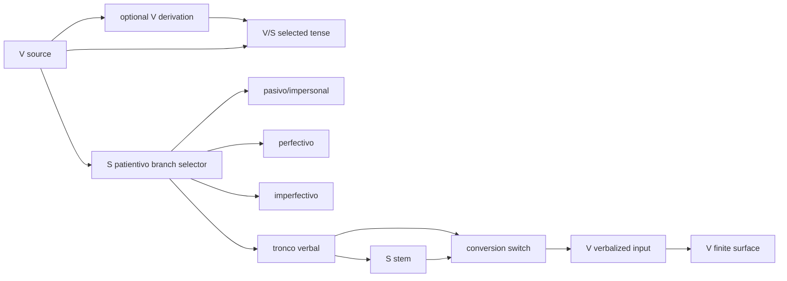

# Nawat Breadcrumb Railroad As-Built Record

Date: 2026-06-01
Workspace: `/Users/jaimenunez/Desktop/Nawat_Conjugator`
Status: Corrected and accepted as the current as-built record for the Nawat breadcrumb rail.

## Executive Map

The rail as built is a permanent `ruta nawat` breadcrumb above Salida and below Entrada. It is not only a patientivo widget. It records ordinary Nawat movement and, when the selected patientivo branch is `tronco verbal`, exposes a conversion fast track to verb outputs.

Scope correction: the tracks just laid are inside the Nawat convention, but they currently reach only the territory that the European convention names `adjetivo`, and only four of the nine adjective circuits. The four wired circuits are `adjetivo-preterito-tik`, `adjetivo-perfecto-tik`, `adjetivo-preterito-naj`, and `adjetivo-perfecto-naj`.

Current visible movement:

| Movement | As-built trail |
| --- | --- |
| Ordinary verb | `V (pusuni) -> V presente` |
| Ordinary noun | `V (pusuni) -> S sustantivo verbal` |
| Causative verb | `V (pusuni) -> V causativa -> V presente` |
| Patientivo branch movement | `V (pusuni) -> S patientivo / <selected branch>` |
| Patientivo conversion approach | `V (pusuni) -> S patientivo / tronco verbal -> conversion` |
| Active conversion route | `V (pusuni) -> S patientivo / tronco verbal -> S pusuk -> conversion -> V (pusuk)-(na) -> V pusuknajtuk` |

The `S patientivo` station is a branch selector, not a fixed `S tronco verbal` chip. Its substations are `pasivo/impersonal`, `perfectivo`, `imperfectivo`, and `tronco verbal`.

## Coordinate System

Official UI coordinate system: `NawatRail_UIGrid_v1`.

This is responsive interface geometry, not geographic geometry. Coordinates are recorded as DOM anchors, CSS grid areas, visible sequence, and state transitions.

## Physical Layout

| Asset | Source | Role |
| --- | --- | --- |
| Rail shell | `index.html:1001-1002` | `#conversion-rail-block` contains permanent `#calc-guidance` rail |
| Salida boundary | `index.html:1141-1143` | Salida owns summary/description only; it no longer owns the breadcrumb rail |
| Desktop grid | `style.css:255-264` | Places the rail under Entrada, right of Derivada, and above Salida |
| Mobile grid | `style.css:271-287` | Stacks rail after Derivada and before Salida |
| Rail grid item | `style.css:300-307` | `grid-area: conversion`, hidden state collapses |
| Later desktop geometry | `style.css:6579-6584` | Narrows Derivada to roughly 300px on desktop |

Desktop grid:

```text
inputs      inputs
derivation  conversion
derivation  output
```

Mobile grid:

```text
tabs
inputs
derivation
conversion
output
```

## Tracks And Stations

### Mainline

Renderer: `renderOutputGuidancePanel()` in `src/ui/rendering/rendering.js:489-936`.

Ordinary movement is built by `renderCurrentMovementBreadcrumb()` at `src/ui/rendering/rendering.js:806-853`.

Stations:

| ID | Station | Source | Mode marker | Travel action |
| --- | --- | --- | --- | --- |
| `ST-RN-001` | Entrada/source | `rendering.js:812-818` | `V` when a verb exists | opens input panel |
| `ST-RN-002` | Derivation stop | `rendering.js:781-805` | `V` | opens tense/derivation panel |
| `ST-RN-003` | Destination tense | `rendering.js:829-850` | `V` or `S` | opens output panel |
| `ST-RN-004` | `S patientivo` branch station | `rendering.js:317-394` | `S` | changes patientivo substation |

### Patientivo Branch Switch

The branch selector is shared by all rail contexts.

| Asset | Source | As-built role |
| --- | --- | --- |
| Branch list | `src/ui/rendering/rendering.js:203-208` | Defines four patientivo substations |
| Branch state getter/setter | `src/ui/rendering/rendering.js:215-236` | Reads/writes `activePatientivoBranch` |
| Branch focus travel | `src/ui/rendering/rendering.js:246-315` | Clears active conversion, switches source scope, renders patientivo, and highlights the target block |
| Branch picker UI | `src/ui/rendering/rendering.js:317-394` | Dropdown chip rendered as `S patientivo / <branch>` |
| State declaration | `script.js:1081-1084` | Declares default `activePatientivoBranch: "tronco-verbal"` |
| Generated state declaration | `src/bootstrap/script_runtime.mjs:1073-1076` | ESM wrapper copy of the same state |
| Styling | `style.css:1992-2010`, `style.css:2074-2158`, `style.css:5302-5305` | Sublabel, caret, dropdown, and route-focus styling |

Branch substations:

| ID | Label | Source scope | Conversion visible |
| --- | --- | --- | --- |
| `ST-PAT-001` | `pasivo/impersonal` | nonactive | no |
| `ST-PAT-002` | `perfectivo` | active | no |
| `ST-PAT-003` | `imperfectivo` | active | no |
| `ST-PAT-004` | `tronco verbal` | active | yes, when convertible stems exist |

### Conversion Approach

The conversion approach is a fast-track switch exposed only on the `tronco verbal` branch.

| Asset | Source | Role |
| --- | --- | --- |
| Four route tracks | `src/ui/rendering/rendering.js:4352-4357` | `-ti` preterit/perfect and `-na` preterit/perfect |
| Absolutive stripping | `src/ui/rendering/rendering.js:4359-4375` | Removes `-ti`, `-in`, and `-t` before testing stems |
| Intermediary consonant gate | `src/ui/rendering/rendering.js:4377-4385` | Admits stems ending `k`, `ch`, `s`, `sh`, `j`, or `t` |
| Candidate yard | `src/ui/rendering/rendering.js:4445-4490` | Collects stripped stems and keeps row output as plain forms |
| Branch guard | `src/ui/rendering/rendering.js:4503-4510` | Prevents the conversion rail from replacing non-tronco patientivo movement |
| Conversion switch | `src/ui/rendering/rendering.js:4547-4630` | Renders menu of available fast-track routes |
| Approach trail | `src/ui/rendering/rendering.js:4632-4651` | `V source -> S patientivo/tronco verbal -> conversion` |

Fast-track route plans:

| ID | Source | Nawat target | Surface |
| --- | --- | --- | --- |
| `TRK-CONV-001` | `data/static_modes.json:18-37` | verb preterit via `-ti` | `-tik` |
| `TRK-CONV-002` | `data/static_modes.json:38-57` | verb perfect via `-ti` | `-tituk` |
| `TRK-CONV-003` | `data/static_modes.json:58-77` | verb preterit via `-na` | `-naj` |
| `TRK-CONV-004` | `data/static_modes.json:78-97` | verb perfect via `-na` | `-najtuk` |

### Active Conversion Route

Active route rendering inserts the patientivo branch station before the stem station.

| Asset | Source | Role |
| --- | --- | --- |
| Surface trail parts | `src/ui/state.js:1071-1136` | Builds visible route parts |
| Station model | `src/ui/state.js:1303-1470` | Builds source, stem, verbalizer, target, and finite stations |
| Active trail injection | `src/ui/rendering/rendering.js:893-932` | Adds `S patientivo / tronco verbal`, stem, conversion, verbalized input, and finite surface |
| Station travel | `src/ui/state.js:1748-1814` | Clicks move forward/back along active route stations |
| `-na` bridge | `src/ui/state.js:856-866` | Formats transitive target input as `(stem)-(na)` |

## Boundaries

| Boundary | As-built state |
| --- | --- |
| Nawat categories | Visible rail uses `V` and `S`; particle exists in mode data but has no live breadcrumb route yet |
| European convention | Still present as legacy metadata and generation backing |
| European adjective scope | Current Nawat tracks cover 4 of the 9 European-convention adjective circuits only |
| Conversion ownership | Row outputs feed candidate data; the breadcrumb rail owns the conversion switch |
| Patientivo branch ownership | The branch station is shared; no conversion-local branch copy remains |
| Semantic name | HTML id remains `conversion-rail-block` with `aria-label="Conversión actual"` as a legacy asset name |

## As-Built Diagram



## Review Results

The second-pass agents found the previous report stale. Corrections made:

- `S patientivo` is now recorded as a dropdown branch station.
- Active conversion route is recorded as passing through `S patientivo / tronco verbal` before the stem.
- `activePatientivoBranch` is declared in the main route state.
- The duplicate conversion-local patientivo picker was removed from source and generated renderer.
- Conversion rail rendering is guarded so non-tronco branches keep the ordinary patientivo breadcrumb.
- GIS/CAD layers and an asset register were produced as official companion files.
- Scope is recorded as four of nine European-convention adjective circuits, not the whole adjective territory.

## Verification Log

Commands run after correction:

```sh
node --check src/ui/rendering/rendering.js
node --check src/ui/rendering/rendering.mjs
node --check script.js
node --check src/bootstrap/script_runtime.mjs
```

Live Safari pass at `http://127.0.0.1:8001`:

| Scenario | Observed |
| --- | --- |
| Tronco patientivo | `V (pusuni) -> S patientivo / muchiwalis takutunti -> conversion`; branch checked `tronco-verbal`; row pickers `0` |
| Nonactive patientivo | `V (pusuni) -> S patientivo / taselilis/tamuchiwalis`; branch checked `nonactive`; conversion pickers `0` |
| Active `-na` perfect route | `V (pusuni) -> S patientivo / muchiwalis takutunti -> S pusuk -> conversion -> V (pusuk)-(na) -> V pusuknajtuk` |

Companion official records:

- `reports/nawat_breadcrumb_railroad_layers.json`
- `reports/nawat_breadcrumb_asset_inventory.csv`
- `reports/nawat_breadcrumb_certification.md`
